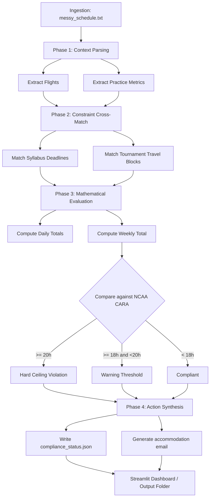

# ScoutFlow AI — Architecture & Flow

This document describes the end-to-end pipeline used in the ScoutFlow AI hackathon submission. It maps the Foundry-inspired reasoning stages used to transform an unstructured coach communication into compliance telemetry and actionable remediation.

## High-level stages

- **Ingestion**: The ingestion layer reads `data/messy_schedule.txt` — free-form coach emails containing flight updates, practice schedule shifts, and other team logistics. The file is treated as raw text and passed to the parsing stage.

- **Phase 1 — Context Parsing (RegEx-driven)**:
  - Uses robust regular expressions to extract flight times and confirmation tokens (e.g., `DELTA-7849KL`).
  - Parses block lines describing practice adjustments, e.g., "Monday through Thursday: 3 hours/day" and "Friday: 4 hours" as well as conditioning sessions (1.5h MWF).
  - Stores parsed tokens in `parsed_schedule` with safe fallbacks when tokens are missing.

- **Phase 2 — Constraint Cross-Match (Relational Mock Work IQ nodes)**:
  - Loads `data/syllabus_deadlines.json` to fetch course deadlines and in-person exam dates.
  - Loads `data/compliance_rules.json` representing NCAA CARA thresholds and warning levels.
  - Cross-references tournament date ranges (e.g., June 20–23, 2026) with exam dates to detect direct collisions or pre-travel proximity (48 hours rule).

- **Phase 3 — Mathematical Evaluation**:
  - Computes daily totals by combining practice and conditioning sessions (example used in the demo: Mon=4.5h, Tue=3h, Wed=4.5h, Thu=3h, Fri=4h → weekly total 19.0h).
  - Applies numeric comparisons against CARA thresholds:
    - Warning threshold: 18.0 hours/week
    - Hard ceiling: 20.0 hours/week
  - Tags events as `WARNING` or `MAJOR/SEVERE` depending on the delta and context.

- **Phase 4 — Action Synthesis**:
  - If conflicts/violations exist, generate structured remediation actions and human-readable email drafts.
  - Writes `data/output/compliance_status.json` containing the telemetry fields used by the Streamlit UI and any generated `accommodation_request_<COURSE>.json` files containing the full email body and subject line.

## Design & Safety notes

- **Robust parsing with fallbacks**: The parser prefers extracted tokens but falls back to safe defaults to avoid exceptions and to keep the agent deterministic during demos.
- **Explicit reasoning traceability**: All internal steps append `[THOUGHT]`, `[EVALUATING]`, or `[ACTION]` entries to `reasoning_log`. The Streamlit UI renders these for judges to review.
- **Email honorific normalization**: Instructor names are parsed for common honorifics (Dr, Professor, Prof, Mr, Ms, Mrs) and normalized to produce respectful greetings such as `Dear Dr. Wong,`.
- **Reproducible outputs**: All final actions are serialized to JSON under `data/output/` so judges can re-run the demo and inspect machine-readable artifacts.

## File references

- Ingestion: `data/messy_schedule.txt`
- Compliance rules: `data/compliance_rules.json`
- Syllabus deadlines: `data/syllabus_deadlines.json`
- Reasoning engine: `src/agents/compliance.py`
- UI: `main.py`
- Outputs: `data/output/compliance_status.json`, `data/output/accommodation_request_<COURSE>.json`

## Quick checklist for judges

1. Run `python setup_mock_data.py` to seed demo data (if not present).
2. Run `python src/agents/compliance.py` to exercise the CLI pipeline and produce JSON outputs.
3. Run `streamlit run main.py` to interactively execute the 3-step flow and view reasoning traces.

---

This architecture doc complements the README and provides an at-a-glance flowchart for judges evaluating reasoning, safety, and reliability.
